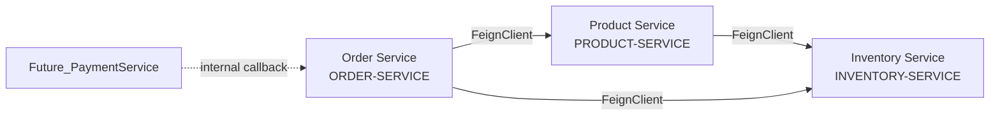

# Enterprise E-Commerce Microservices — Agent Memory

> **Purpose**: Single-file quick-reference for any AI agent working on this project.
> **Last analysed**: 2026-07-22
> **Root**: `/home/shubham/IdeaProjects/enterprise-ecommerce-microservices`
> **🔄 Update policy**: This file MUST be updated after every major change. See §12 and [AGENT_INSTRUCTIONS.md](file:///home/shubham/IdeaProjects/enterprise-ecommerce-microservices/.agents/AGENT_INSTRUCTIONS.md).


---

## 1. High-Level Architecture

```
┌──────────────┐
│   Frontend   │  (React :3000 / Angular :4200 / Vite :5173)
└──────┬───────┘
       │ HTTP (Bearer JWT)
┌──────▼───────────────────────────────────────────────────────────┐
│                     API Gateway  :8282                           │
│  Spring Cloud Gateway (reactive / WebFlux)                       │
│  ┌─────────────────┐  ┌──────────────────┐  ┌────────────────┐  │
│  │ AuthFilter (JWT) │→ │ RouteValidator   │→ │ Proxy/Route    │  │
│  │  (GlobalFilter)  │  │ (RBAC check)     │  │ to service     │  │
│  └─────────────────┘  └──────────────────┘  └────────────────┘  │
└──────┬───────────┬───────────┬───────────┬──────────────────────┘
       │           │           │           │
       ▼           ▼           ▼           ▼
  ┌─────────┐ ┌─────────┐ ┌──────────┐ ┌─────────┐
  │  Auth   │ │ Product │ │Inventory │ │  Order  │
  │ Service │ │ Service │ │ Service  │ │ Service │
  │  :8081  │ │  :8082  │ │  :8083   │ │  :8084  │
  └────┬────┘ └────┬────┘ └────┬─────┘ └────┬────┘
       │           │           │             │
       ▼           ▼           ▼             ▼
  auth_db    product_db   inventory_db   order_db
  (PG)        (PG)          (PG)          (PG)
```

**Infrastructure Services** (start first):
| Service           | Port | Role                                   |
|-------------------|------|----------------------------------------|
| Config Server     | 8888 | Spring Cloud Config (native profile, reads `local-config/`)  |
| Discovery Server  | 8761 | Eureka Service Registry                |

**Tech Stack**: Java 21, Spring Boot 3.5.3, Spring Cloud 2025.0.0, PostgreSQL 17, Maven, Lombok, jjwt, Resilience4j, OpenFeign, Flyway (inventory-service).

---

## 2. Module Map — Base Packages & Key Classes

### 2.1 Config Server
- **Package**: `com.ecommerce.configserver`
- **Config files served**: `local-config/{auth-service,product-service,inventory-service,api-gateway}.yml`
- **Role**: Resolves `${VAR}` placeholders (JWT_SECRET, DB creds) server-side.

### 2.2 Discovery Server
- **Package**: `com.ecommerce.discoveryserver`
- **Eureka dashboard**: `http://localhost:8761`

### 2.3 API Gateway — `com.ecommerce.gateway`
| File | Path | Purpose |
|------|------|---------|
| `ApiGatewayApplication` | `gateway/` | Main class |
| `AuthenticationFilter` | `gateway/filter/` | `GlobalFilter` (order = -1). Validates JWT, extracts email/role/userId, checks RBAC, injects `X-User-Email`, `X-User-Role`, `X-User-Id` headers. |
| `RouteValidator` | `gateway/filter/` | Defines `PUBLIC_ENDPOINTS` (register, login, refresh, logout). `hasRequiredRole()` encodes all RBAC rules. |
| `JwtService` | `gateway/security/` | Validates token (checks `token_type == "access"` + expiry). Extracts `sub`, `role`, `userId` claims. Uses `@Value("${jwt.secret}")`. |
| `CorsConfig` | `gateway/config/` | Allows origins :3000, :4200, :5173. All standard methods + credentials. |
| `GlobalExceptionHandler` | `gateway/exception/` | Custom WebFlux error handler. |
| `ErrorResponse` | `gateway/exception/` | Error DTO: `{status, error, message, path, timestamp}`. |

### 2.4 Auth Service — `com.ecommerce.auth`  (Port 8081)
| Layer | Key Classes |
|-------|-------------|
| **Controller** | `AuthController` (`/auth` → register, login, refresh, logout, test) |
| | `TestController`, `RoleTestController` (dev/test) |
| **Service** | `AuthService` (register/login/refresh/logout logic) |
| | `JwtService` (generates access + refresh JWTs; `@Value jwt.secret, jwt.access-expiration, jwt.refresh-expiration`) |
| | `RefreshTokenService` (token rotation, revocation) |
| | `CustomUserDetailsService` (loads User for Spring Security) |
| **Entity** | `User` (id UUID, email, password, role UserRole, createdAt) — table `users` |
| | `RefreshToken` (id UUID, token, expiryDate, createdAt, revoked, revokedAt, user ManyToOne) — table `refresh_tokens` |
| **Repository** | `UserRepository`, `RefreshTokenRepository` |
| **Enum** | `UserRole` → `ROLE_USER, ROLE_ADMIN, ROLE_SELLER` |
| **Config** | `SecurityConfig` (Spring Security filter chain), `OpenApiConfig`, `RefreshTokenSchemaMigration` |
| **Exception** | `ResourceNotFoundException`, `TokenExpiredException`, `InvalidTokenException`, `UserAlreadyExistException`, `GlobalExceptionHandler` |
| **DTO** | `RegisterRequest`, `LoginRequest`, `RefreshTokenRequest`, `AuthResponse` |
| **DB** | `auth_db` (PG, port 5433 in Docker) |

**Auth Flow**:
1. `POST /api/v1/auth/register` → saves User with `ROLE_USER`, BCrypt-hashed password.
2. `POST /api/v1/auth/login` → `AuthenticationManager.authenticate()`, generates access JWT (700s) + refresh JWT (9000s), persists `RefreshToken`.
3. `POST /api/v1/auth/refresh` → rotates refresh token (old revoked, new issued).
4. `POST /api/v1/auth/logout` → revokes refresh token.

**JWT Claims**: `sub` (email), `role`, `userId`, `token_type` ("access"/"refresh"), `iat`, `exp`, `jti`.

### 2.5 Product Service — `com.ecommerce.product`  (Port 8082)
| Layer | Key Classes |
|-------|-------------|
| **Controller** | `ProductController` (`/api/v1/products`), `CategoryController` (`/api/v1/categories`), `SearchController` |
| **Service** | `ProductService` (interface), `ProductServiceImpl` |
| | `CategoryService` / `CategoryServiceImpl` |
| | `SearchService` / `SearchServiceImpl` |
| **Entity** | `Product` (id, name, slug, shortDescription, fullDescription, brand, skuCode, category ManyToOne, status, active, pricing OneToOne, images OneToMany, attributes OneToMany) — table `product` |
| | `Category` (id, name, description, parentCategory self-ref, active) — table `category` |
| | `ProductPricing` (product OneToOne, basePrice, discountPrice) |
| | `ProductImage` (product ManyToOne, imageUrl, displayOrder, isPrimary) |
| | `ProductAttribute` (product ManyToOne, attributeName, attributeValue) |
| | `BaseEntity` (createdAt, updatedAt, createdBy, updatedBy — JPA auditing) |
| **Repository** | `ProductRepository`, `CategoryRepository`, `ProductImageRepository`, `ProductAttributeRepository`, `ProductPricingRepository` |
| **Enum** | `ProductStatus` → `DRAFT, ACTIVE, INACTIVE, DISCONTINUED` |
| **Mapper** | `ProductMapper`, `CategoryMapper` |
| **Client** | `InventoryClient` (FeignClient → `INVENTORY-SERVICE`, circuit breaker `inventoryService`) |
| | Calls `POST /api/v1/inventory/internal/provision` to auto-provision inventory on product creation |
| | `InventoryClientFallbackFactory` (returns sentinel with `inventoryId=null` → status "DEFERRED") |
| **Config** | `HeaderAuthenticationFilter` (extracts `X-User-Email`, `X-User-Role` from gateway headers), `SecurityConfig`, `JpaAuditConfig`, `SwaggerConfig` |
| **Exception** | `ResourceNotFoundException`, `BusinessException`, `ProductErrorCode`, `GlobalExceptionHandler` |
| **Spec** | `ProductSpecification` (JPA Specification for dynamic queries) |
| **DB** | `product_db` (PG, port 5435 in Docker) |

**Key Behaviour**:
- `createProduct()` → persists Product + Pricing + Images + Attributes in one TX, then calls inventory-service to provision stock (circuit-breaker protected). Status returned as `PROVISIONED` or `DEFERRED`.
- SKU generation: `BRAND-NAME-RANDOM_HEX`.
- Slug generated via `SlugGenerator`.
- Delete = soft-delete (`active=false`, `status=INACTIVE`).
- Pagination via `PaginatedResponse` from common library.

### 2.6 Inventory Service — `com.ecommerce.inventory`  (Port 8083)
| Layer | Key Classes |
|-------|-------------|
| **Controller** | `InventoryController` (`/api/v1/inventory`) — Admin, Internal, Read endpoint groups |
| **Service** | `InventoryService` (interface), `InventoryServiceImpl` |
| **Entity** | `Inventory` (id UUID, productId UUID, availableQuantity, reservedQuantity, warehouseCode, lowStockThreshold, active, version @Version) — table `inventory` |
| | `BaseEntity` (createdAt, updatedAt, createdBy, updatedBy) |
| **Repository** | `InventoryRepository` (`findByProductIdAndWarehouseCode`, `existsByProductIdAndWarehouseCode`, `findAllByProductId`, `findAllLowStock`) |
| **Enum** | `StockAdjustmentType` → `INCREASE, DECREASE` |
| **Mapper** | `InventoryMapper` |
| **Config** | `HeaderAuthenticationFilter`, `SecurityConfig`, `JpaAuditConfig`, `SwaggerConfig` |
| **Exception** | `ResourceNotFoundException`, `BusinessException`, `ErrorCode`, `GlobalExceptionHandler` |
| **DB** | `inventory_db` (PG, port 5436 in Docker) |
| **Migration** | Flyway (`db/migration/`) |

**Stock Lifecycle (Saga Pattern)**:
```
Reserve:   available -= qty  |  reserved += qty   (order placed)
Release:   reserved -= qty   |  available += qty   (order cancelled)
Confirm:   reserved -= qty                         (order fulfilled)
```
- Negative stock NEVER allowed.
- **Optimistic locking** via `@Version` prevents concurrent double-reservation.
- Unique constraint on `(product_id, warehouse_code)`.

**Endpoints**:
| Method | Path | Role | Operation |
|--------|------|------|-----------|
| POST | `/api/v1/inventory` | ADMIN | Create inventory record |
| POST | `/api/v1/inventory/internal/provision` | INTERNAL_SERVICE | Auto-provision (called by product-service) |
| PATCH | `/{productId}/adjust` | ADMIN | Adjust stock (INCREASE/DECREASE) |
| PATCH | `/{productId}/threshold` | ADMIN | Update low-stock threshold |
| PATCH | `/reserve` | INTERNAL_SERVICE | Reserve stock for order |
| PATCH | `/release` | INTERNAL_SERVICE | Release reservation |
| PATCH | `/confirm` | INTERNAL_SERVICE | Confirm stock deduction |
| GET | `/{productId}?warehouseCode=` | Authenticated | Get inventory |
| GET | `/check/{productId}` | Authenticated | Check availability |
| GET | `/low-stock` | Authenticated | List low-stock items |

### 2.7 Order Service — `com.ecommerce.order`  (Port 8084)
| Layer | Key Classes |
|-------|-------------|
| **Controller** | `OrderController` (`/api/v1/orders`) — create, get, my-orders, cancel, status update |
| | `InternalOrderController` (`/api/v1/internal/orders`) — payment-success, payment-failed callbacks |
| **Service** | `OrderService` (interface), `OrderServiceImpl` |
| **Entity** | `Order` (id UUID, orderNumber, userId, totalAmount, status, paymentStatus, shipping fields, items OneToMany) — table `orders` |
| | `OrderItem` (id UUID, order ManyToOne, productId, warehouseCode, quantity, unitPrice, subtotal) — table `order_items` |
| | `BaseEntity` (createdAt, updatedAt, createdBy, updatedBy) |
| **Repository** | `OrderRepository`, `OrderItemRepository` |
| **Enum** | `OrderStatus` → `CREATED, CONFIRMED, CANCELLED, SHIPPED, DELIVERED` |
| | `PaymentStatus` → `PENDING, SUCCESS, FAILED, REFUNDED` |
| **Mapper** | `OrderMapper` |
| **Client** | `ProductServiceClient` (FeignClient → `PRODUCT-SERVICE`) — `GET /api/v1/products/{id}` |
| | `InventoryServiceClient` (FeignClient → `INVENTORY-SERVICE`) — checkAvailability, reserveStock, releaseStock, confirmStock |
| | Fallback factories for both clients |
| **Client DTOs** | `ProductClientResponse`, `ProductPricingClientResponse`, `InventoryAvailabilityResponse`, `ReserveInventoryRequest`, `ReleaseInventoryRequest`, `ConfirmInventoryRequest` |
| **Exception** | `GlobalExceptionHandler` |
| **DB** | `order_db` (PG, port 5437 in Docker) |

**Order Flow (Distributed Saga — Compensating Transactions)**:
1. For each item: validate product via Product Service → check inventory → reserve stock.
2. Build Order entity, assign `ORD-XXXXX` number, save.
3. On **any failure**: release all successfully reserved stock (compensating rollback).
4. Payment callbacks (future Payment Service):
   - `PATCH /api/v1/internal/orders/{id}/payment-success` → `CONFIRMED` + confirm inventory
   - `PATCH /api/v1/internal/orders/{id}/payment-failed` → `CANCELLED` + release inventory

**Order Status State Machine**:
```
CREATED → CONFIRMED → SHIPPED → DELIVERED
    ↓         ↓
CANCELLED  CANCELLED
```
- Cannot cancel if already `SHIPPED` or `DELIVERED`.
- Must be `CONFIRMED` before `SHIPPED`.
- Must be `SHIPPED` before `DELIVERED`.

---

## 3. Shared Library — `ecommerce-common` (1.0.0-SNAPSHOT)

Multi-module Maven project (`<packaging>pom</packaging>`) consumed as dependencies by business services.

| Module | Package | Key Classes |
|--------|---------|-------------|
| `common-exception` | `com.ecommerce.common.exception` | `BaseException`, `BusinessException`, `ResourceNotFoundException`, `AccessDeniedException`, `InvalidTokenException`, `TokenExpiredException`, `UserAlreadyExistsException`, `ErrorCode` |
| | `...exception.handler` | `GlobalExceptionHandler` |
| `common-response` | `com.ecommerce.common.response` | `ApiResponse<T>` (success envelope), `PaginatedResponse<T>` (pagination envelope), `FieldError` |
| `common-security` | `com.ecommerce.common.security` | `SecurityConstants` (header names: `X-User-Id`, `X-User-Email`, `X-User-Role`, JWT claim keys, public paths) |
| | `...security.annotation` | `@CurrentUser` (parameter annotation) |
| `common-dto` | `com.ecommerce.common.dto` | `AuditableDto`, `SortablePageRequest` |
| `common-util` | `com.ecommerce.common.util` | `SlugGenerator`, `PageableUtils`, `DateUtils` |
| `common-events` | `com.ecommerce.common.event` | `BaseEvent`, `EventType` enum (forward-looking: product/inventory/order/payment/user/notification events for future Kafka integration) |

---

## 4. Security & RBAC — Authoritative Reference

### 4.1 User Roles
| Role | Enum Value | Scope |
|------|-----------|-------|
| User | `ROLE_USER` | Read-only access to products, categories, orders |
| Seller | `ROLE_SELLER` | Create/update products |
| Admin | `ROLE_ADMIN` | Full access: products, categories, inventory, orders |
| Internal | `ROLE_INTERNAL_SERVICE` / `INTERNAL_SERVICE` | Service-to-service calls (inventory reserve/release/confirm, internal orders) |

### 4.2 Public Endpoints (No JWT Required)
```
/api/v1/auth/register
/api/v1/auth/login
/api/v1/auth/refresh
/api/v1/auth/logout
```

### 4.3 RBAC Matrix (enforced in `RouteValidator.hasRequiredRole()`)
| Path Pattern | Method(s) | Required Role(s) |
|---|---|---|
| `/api/v1/products` | GET | Any authenticated |
| `/api/v1/products` | POST, PUT, PATCH | ADMIN or SELLER |
| `/api/v1/products/**` | DELETE | ADMIN |
| `/api/v1/categories` | GET | Any authenticated |
| `/api/v1/categories` | POST, PUT, DELETE | ADMIN |
| `/api/v1/inventory` | POST, PUT, PATCH | ADMIN |
| `/api/v1/inventory/**/provision`, `/reserve`, `/release`, `/confirm` | * | INTERNAL_SERVICE |
| `/api/v1/inventory/**` | GET | Any authenticated |
| `/api/v1/orders` (exact) | GET | ADMIN (fetch all) |
| `/api/v1/orders/**` | POST, GET (by ID, my-orders), PATCH (cancel) | Any authenticated (ownership check in service) |
| `/api/v1/orders/**/status` | PATCH | ADMIN |
| `/api/v1/internal/orders/**` | * | INTERNAL_SERVICE |

### 4.4 Header-Based Auth for Downstream Services
Gateway injects these headers on successful JWT validation:
- `X-User-Email` — user's email (from JWT `sub`)
- `X-User-Role` — user's role (from JWT `role` claim)
- `X-User-Id` — user's UUID (from JWT `userId` claim)

Downstream services use `HeaderAuthenticationFilter` to read these headers. They **do NOT** validate JWT themselves.

---

## 5. Inter-Service Communication

All inter-service calls use **OpenFeign + Eureka service discovery + Resilience4j circuit breakers**.



### 5.1 Product → Inventory
| Client | Target Endpoint | Purpose |
|--------|----------------|---------|
| `InventoryClient` | `POST /api/v1/inventory/internal/provision` | Auto-provision stock on product creation |
| `InventoryClient` | `GET /api/v1/inventory/check/{productId}` | Check availability |

**Fallback**: Returns sentinel `CreateInventoryResponse` with `inventoryId=null` → product still created, inventory status = `DEFERRED`.

### 5.2 Order → Product
| Client | Target Endpoint | Purpose |
|--------|----------------|---------|
| `ProductServiceClient` | `GET /api/v1/products/{id}` | Validate product exists + fetch pricing |

### 5.3 Order → Inventory
| Client | Target Endpoint | Purpose |
|--------|----------------|---------|
| `InventoryServiceClient` | `GET /api/v1/inventory/check/{productId}` | Check availability before order |
| `InventoryServiceClient` | `PATCH /api/v1/inventory/reserve` | Reserve stock |
| `InventoryServiceClient` | `PATCH /api/v1/inventory/release` | Release stock (cancel/failure) |
| `InventoryServiceClient` | `PATCH /api/v1/inventory/confirm` | Confirm stock deduction (payment success) |

### 5.4 Future: Payment → Order
| Target Endpoint | Purpose |
|----------------|---------|
| `PATCH /api/v1/internal/orders/{id}/payment-success` | Confirm order + confirm inventory |
| `PATCH /api/v1/internal/orders/{id}/payment-failed` | Cancel order + release inventory |

---

## 6. Database Schema Summary

### 6.1 auth_db
| Table | Key Columns |
|-------|-------------|
| `users` | id (UUID PK), email (unique), password (BCrypt), role (ENUM), created_at |
| `refresh_tokens` | id (UUID PK), token (unique, indexed), expiry_date, revoked, revoked_at, user_id (FK → users) |

### 6.2 product_db
| Table | Key Columns |
|-------|-------------|
| `product` | id (UUID PK), name, slug (unique), short_description, full_description, brand, sku_code (unique, indexed), category_id (FK), status (ENUM), active |
| `category` | id (UUID PK), name (unique), description, parent_category_id (self-FK), active |
| `product_pricing` | id, product_id (FK → product, unique), base_price, discount_price |
| `product_image` | id, product_id (FK), image_url, display_order, is_primary |
| `product_attribute` | id, product_id (FK), attribute_name, attribute_value |

### 6.3 inventory_db
| Table | Key Columns |
|-------|-------------|
| `inventory` | id (UUID PK), product_id, warehouse_code, available_quantity, reserved_quantity, low_stock_threshold, active, version (@Version optimistic lock) |
| Constraint: `UNIQUE(product_id, warehouse_code)` |
| Indexes: `idx_inventory_product_id`, `idx_inventory_warehouse_code` |

### 6.4 order_db
| Table | Key Columns |
|-------|-------------|
| `orders` | id (UUID PK), order_number (unique, indexed), user_id (indexed), total_amount, status (indexed), payment_status, shipping_* fields |
| `order_items` | id (UUID PK), order_id (FK), product_id, warehouse_code, quantity, unit_price, subtotal |

All business-service tables extend `BaseEntity` providing: `created_at`, `updated_at`, `created_by`, `updated_by` (JPA auditing).

---

## 7. Configuration & Environment

### 7.1 Config Sources
- **Spring Cloud Config**: `config-server` serves from `local-config/` directory (native profile).
- **Environment variables**: Secrets via `.env` file (git-ignored). See `.env.example`.
- **Service-specific**: Each service also has an `application.yml` in its own `src/main/resources/`.

### 7.2 Key Config Properties
| Property | Where Set | Default | Description |
|----------|----------|---------|-------------|
| `jwt.secret` | .env (`JWT_SECRET`) | — | HMAC signing key (min 32 chars) |
| `jwt.access-expiration` | .env | 700000 (ms ≈ 11.7 min) | Access token TTL |
| `jwt.refresh-expiration` | .env | 9000000 (ms ≈ 2.5 hrs) | Refresh token TTL |
| `spring.jpa.hibernate.ddl-auto` | .env | `update` | Schema strategy |
| `eureka.client.service-url.defaultZone` | docker-compose / .env | `http://localhost:8761/eureka` | Eureka URL |

### 7.3 Docker Compose Services & Ports
| Service | Container | Internal Port | Host Port Variable |
|---------|-----------|--------------|-------------------|
| auth-postgres | auth-postgres | 5432 | `AUTH_POSTGRES_PORT` (5433) |
| product-postgres | product-postgres | 5432 | `PRODUCT_POSTGRES_PORT` (5435) |
| inventory-postgres | inventory-postgres | 5432 | `INVENTORY_POSTGRES_PORT` (5436) |
| order-postgres | order-postgres | 5432 | `ORDER_POSTGRES_PORT` (5437) |
| config-server | config-server | 8888 | `CONFIG_SERVER_PORT` |
| discovery-server | discovery-server | 8761 | `DISCOVERY_SERVER_PORT` |
| auth-service | auth-service | 8081 | `AUTH_SERVICE_PORT` |
| product-service | product-service | 8082 | `PRODUCT_SERVICE_PORT` |
| inventory-service | inventory-service | 8083 | `INVENTORY_SERVICE_PORT` |
| order-service | order-service | 8084 | `ORDER_SERVICE_PORT` |
| api-gateway | api-gateway | 8282 | `API_GATEWAY_PORT` |

**Startup order**: Databases → Config Server → Discovery Server → Business Services (auth, product, inventory, order) → API Gateway.

---

## 8. Patterns & Conventions

### 8.1 Project Conventions
- **Package structure**: `com.ecommerce.{service-name}.{layer}` where layer = `controller`, `service`, `service.serviceImpl`, `entity`, `repository`, `dto`, `dto.request`, `dto.response`, `mapper`, `config`, `exception`, `enums`, `client`, `specification`, `util`
- **Service interfaces**: Each service has an interface (`XxxService`) and implementation (`XxxServiceImpl`) in a `serviceImpl` sub-package.
- **DTO pattern**: Request DTOs in `dto.request.*`, Response DTOs in `dto.response.*`. Mappers convert Entity ↔ DTO.
- **Soft delete**: Products and Inventory have `active` boolean (soft-delete). `deleteProduct()` sets `active=false` + `status=INACTIVE`.
- **UUID everywhere**: All entity primary keys are UUIDs, auto-generated.
- **Lombok**: `@Getter @Setter @NoArgsConstructor @AllArgsConstructor @Builder` on all entities/DTOs.
- **Validation**: Jakarta Bean Validation (`@Valid`, `@NotNull`, `@Min`) on controller method parameters.
- **Logging**: SLF4J + Logback. Each class uses its own logger via `LoggerFactory` or `@Slf4j`.

### 8.2 Security Pattern for New Services
1. **No Spring Security dependency** needed in downstream services.
2. Add `HeaderAuthenticationFilter` (extends `OncePerRequestFilter`) to extract `X-User-Email`, `X-User-Role`, `X-User-Id` from gateway headers.
3. Trust the gateway — it has already validated JWT and enforced RBAC.
4. Add route config in `config-server/configurations/api-gateway.yml`.
5. Add RBAC rules in `RouteValidator.hasRequiredRole()` method.

### 8.3 Adding a New Feign Client
1. Define `@FeignClient(name = "SERVICE-NAME", fallbackFactory = XxxFallbackFactory.class)` interface.
2. Create `XxxFallbackFactory` implementing `FallbackFactory<XxxClient>`.
3. Configure Resilience4j circuit breaker in the service's YAML config.
4. Eureka name must match the target service's `spring.application.name` (uppercase).

### 8.4 Error Handling
- Gateway: `GlobalExceptionHandler` + `CustomErrorAttributes` (WebFlux).
- Business services: `@RestControllerAdvice GlobalExceptionHandler` using common-exception classes.
- Standard error shape: `{ status, error, message, path, timestamp }`.

---

## 9. Health Checks & Observability
| Service | Health URL |
|---------|-----------|
| Config Server | `http://localhost:8888/actuator/health` |
| Discovery Server | `http://localhost:8761` (dashboard) |
| API Gateway | `http://localhost:8282/actuator/health` |
| Auth Service | `http://localhost:8081/actuator/health` |
| Product Service | `http://localhost:8082/actuator/health` |
| Inventory Service | `http://localhost:8083/actuator/health` |
| Inventory Swagger | `http://localhost:8083/swagger-ui.html` |
| Order Service | `http://localhost:8084/actuator/health` |

---

## 10. Future / Planned Services

From `EventType` enum and codebase analysis:
- **Payment Service** — event types defined (`PAYMENT_INITIATED/COMPLETED/FAILED/REFUNDED`), internal order callbacks already built.
- **Notification Service** — event types defined (`NOTIFICATION_EMAIL/PUSH_REQUESTED`).
- **Kafka integration** — `common-events` module provides `BaseEvent` and `EventType` for future event-driven architecture.

---

## 11. Quick Lookup — File Finder

### "Where do I find…"

| What | File Path (relative to root) |
|------|-----|
| JWT token generation | `auth-service/src/.../service/JwtService.java` |
| JWT validation (gateway) | `api-gateway/src/.../security/JwtService.java` |
| RBAC rules | `api-gateway/src/.../filter/RouteValidator.java` |
| Gateway auth filter | `api-gateway/src/.../filter/AuthenticationFilter.java` |
| CORS config | `api-gateway/src/.../config/CorsConfig.java` |
| User entity | `auth-service/src/.../entity/User.java` |
| Product entity | `product-service/src/.../entity/Product.java` |
| Inventory entity | `inventory-service/src/.../entity/Inventory.java` |
| Order entity | `order-service/src/.../entity/Order.java` |
| OrderItem entity | `order-service/src/.../entity/OrderItem.java` |
| Product→Inventory Feign | `product-service/src/.../client/InventoryClient.java` |
| Order→Product Feign | `order-service/src/.../client/ProductServiceClient.java` |
| Order→Inventory Feign | `order-service/src/.../client/InventoryServiceClient.java` |
| Docker Compose | `docker-compose.yml` |
| Env template | `.env.example` |
| Shared exceptions | `ecommerce-common/common-exception/` |
| Shared response DTOs | `ecommerce-common/common-response/` |
| Security constants | `ecommerce-common/common-security/.../SecurityConstants.java` |
| Event types (future) | `ecommerce-common/common-events/.../EventType.java` |
| Gateway route configs | `local-config/api-gateway.yml` + `config-server/src/main/resources/configurations/api-gateway.yml` |
| Inventory Flyway migrations | `inventory-service/src/main/resources/db/migration/` |
| Header auth filter (downstream) | `product-service/src/.../config/HeaderAuthenticationFilter.java` (same pattern in inventory-service) |
| Agent instructions | `.agents/AGENT_INSTRUCTIONS.md` |
| This memory file | `.agents/knowledge/project-architecture-memory.md` |

---

## 12. Maintenance Protocol

> **⚠️ This document MUST be kept in sync with the codebase.**
> See [AGENT_INSTRUCTIONS.md](file:///home/shubham/IdeaProjects/enterprise-ecommerce-microservices/.agents/AGENT_INSTRUCTIONS.md) for the full update policy.

### When to Update This File
After any of these changes:
- New service, entity, table, endpoint, enum value, or Feign client added
- RBAC rule, port, or config property changed
- Docker Compose or shared library changed
- Architecture pattern or convention changed

### How to Update
1. Edit only the affected section(s) — do NOT rewrite the entire file.
2. Update the `Last analysed` date in the header (line 4).
3. Update `lastUpdated` in `.agents/knowledge/metadata.json`.
4. Add an entry to the Changelog below.

### Changelog

| Date | Change Summary |
|------|----------------|
| 2026-07-22 | Initial creation — full analysis of all 7 services, 4 databases, RBAC, inter-service flows, common library, Docker Compose |
